# MNISTの学習・評価（Chainer）

## 目次

1. [用いた最適化手法について](#用いた最適化手法について)
    - SGD
    - Momentum SGD
    - AdaGrad
    - RMSprop
    - Adam
2. [MLPを用いた実装](#mlpを用いた実装)
    - [考察](#mlpの考察)
      - [CPUにおける実行](#cpuにおける実行)
      - [GPUにおける実行](#gpuにおける実行)
3. [CNNを用いた実装](#cnnを用いた実装)
    - [考察](#cnnの考察)
      - [CPUにおける実行](#cpuにおける実行)
      - [GPUにおける実行](#gpuにおける実行)

---

## 用いた最適化手法について

今回，5つの最適化手法を用いて，実験・考察を行なった．  
最もシンプルなSGDから，改良を重ねたAdamを通して，精度や実行時間をみた．  
以下，それぞれの手法の簡易的説明，そして式を記す．

### SGD

勾配降下法と呼ばれる手法であり，多くはミニバッチで行われるため，確率的勾配降下法とも呼ばれる．  
パラメタの勾配を求め，それらを用いて，最適化を行う最もシンプルな方法である．  
しかし，収束の不安定性・遅さから高次元の問題で使われることはない．

### Momentum SGD

物理のモーメンタムを用いた手法．vは速度を表し，ボールが池面の傾斜を転がるように動く．  
SGDに比べて，x軸方向に受ける力が小さく，y軸方向には受ける力が大きいが，速度は安定しないので，SGDに比べてx軸方向へ早く近づくことができる．

### AdaGrad

AdaGradは，パラメタの要素ごとに適応的に学習係数を調整しながら学習を行う手法である．  
hはこれまで経験した勾配の値を2乗和として保持することによって，学習のスケールを調整．

### RMSprop

RMSpropはAdaGradを改良したアルゴリズムである．  
AdaGradは学習率が0に十分近くなってしまうと，まだ坂があったとしてもほとんど更新されなくなってしまうという問題があった．  
そこで提案されたRMSpropは初期の影響がαに応じて指数的に減衰する．

### Adam

RMSpropの改良版である．  
勾配に関しては，RMSpropのように，指数的減衰をするが，これに加え過去の勾配の指数関数的減数平均を保持する．

---

## MLPを用いた実装

[Chainerのドキュメント](https://docs.chainer.org/en/stable/examples/mnist.html)を参考に実装

  

入力層: 100ノード  
中間層: 100ノード  
出力層: 10ノード

### MLPの考察

#### CPUにおける実行
AdaGrad, Adam, Momentum SGD, RMSprop, SGDで実行した．  
以下，それらにおける精度と実行時間の比較を行なった際の結果である．

  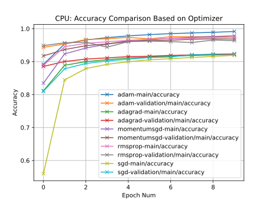

|| 1 | 2 | 3 | 4 | 5 | 6 | 7 | 8 | 9 | 10|
|--------------|:-:|:-:|:-:|:-:|:-:|:-:|:-:|:-:|:-:|:-:|
|SGD|0.56|0.845|0.879|0.892|0.9|0.906|0.909|0.913|0.916|0.919|0.81|0.878|0.894|0.902|0.907|0.912|0.914|0.921|0.923|0.924|
|Momentum SGD|0.835|0.924|0.941|0.953|0.961|0.966|0.97|0.974|0.976|0.979|0.918|0.937|0.948|0.954|0.963|0.964|0.965|0.968|0.969|0.969|
|AdaGrad|0.812|0.889|0.9|0.906|0.911|0.914|0.916|0.919|0.921|0.923|0.886|0.901|0.908|0.911|0.915|0.917|0.919|0.921|0.922|0.922|
|RMSprop|0.889|0.945|0.956|0.96|0.965|0.968|0.97|0.971|0.973|0.974|0.949|0.957|0.959|0.944|0.961|0.962|0.961|0.958|0.966|0.964|
|Adam|0.892|0.954|0.966|0.973|0.978|0.982|0.985|0.987|0.989|0.992|0.944|0.954|0.967|0.97|0.974|0.969|0.976|0.975|0.976|0.974|

Chainerのclassifierにおけるaccuracyは確率が最も高い分類の数値を表している．  

その結果，Adamが最も確率が高く，SGDが最も低いということがわかった．  
また，いずれもvalidationの精度はmainの精度よりも低く，うまく実行ができていることが確認できた．  

最適化を行う際，損失を最小にしようとする．以下の図は損失を最適化手法ごとにプロットした図である．  

  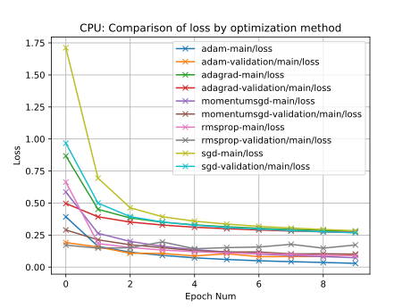

|| 1 | 2 | 3 | 4 | 5 | 6 | 7 | 8 | 9 | 10|
|--------------|:-:|:-:|:-:|:-:|:-:|:-:|:-:|:-:|:-:|:-:|
|SGD|1.712|0.694|0.463|0.393|0.358|0.336|0.318|0.305|0.294|0.283|0.967|0.499|0.394|0.352|0.327|0.309|0.297|0.285|0.276|0.268|
|Momentum SGD|0.586|0.264|0.2|0.162|0.136|0.118|0.102|0.091|0.082|0.073|0.29|0.213|0.174|0.152|0.128|0.118|0.118|0.103|0.104|0.102|
|AdaGrad|0.868|0.451|0.383|0.351|0.33|0.315|0.303|0.294|0.286|0.279|0.497|0.392|0.351|0.328|0.311|0.3|0.29|0.282|0.275|0.27|
|RMSprop|0.664|0.184|0.153|0.133|0.121|0.11|0.107|0.098|0.092|0.09|0.171|0.148|0.151|0.197|0.143|0.152|0.157|0.178|0.148|0.173|
|Adam|0.392|0.162|0.116|0.091|0.072|0.06|0.049|0.042|0.036|0.029|0.191|0.157|0.108|0.106|0.087|0.104|0.082|0.082|0.083|0.096|

上記の見ると，それぞれ損失がエポックが進むにつれ，下がっているのがわかる．

同時にelapsed time（実行時間）をプロットしてみたところ，以下のような結果となった.

  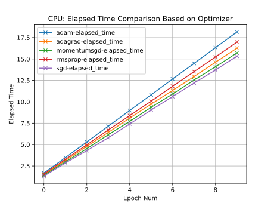

また，実行時間の詳細を下記に記す．

|| 1 | 2 | 3 | 4 | 5 | 6 | 7 | 8 | 9 | 10|  
|--------------|:-:|:-:|:-:|:-:|:-:|:-:|:-:|:-:|:-:|:-:|  
|SGD|1.321|2.85|4.303|5.805|7.419|9.036|10.613|12.194|13.711|15.333|  
|Momentum SGD|1.43|2.982|4.523|6.162|7.708|9.355|10.912|12.536|14.087|15.715|  
|AdaGrad|1.487|3.136|4.799|6.422|8.108|9.734|11.326|12.949|14.622|16.263|  
|RMSprop|1.568|3.272|4.977|6.71|8.385|10.07|11.815|13.518|15.242|16.971|  
|Adam|1.684|3.477|5.313|7.152|8.983|10.82|12.661|14.486|16.33|18.157|  

実行時間をみると，最も精度が高かったAdamに時間がかかっていることがわかる．逆に，SGDは3秒程度短い時間で終わっていることがわかる．  
これは，計算する更新量について考えると明らかである．  
今回の計算は全てO(次元数)であるため，実行時間が線形である．しかし，それぞれの更新式において，メモリにアクセスする回数，そしてそれらを更新する回数はより精度が高いとされるものほど多い（以下の #用いた最適手法について を参照）．  
また，Momentum SGDはSGDの改良版，RMSpropはAdaGradの改良版であるということは，精度・損失からもわかる．

#### GPUにおける実行

  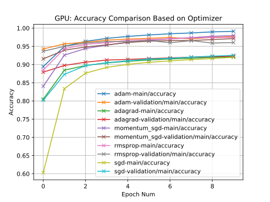

|| 1 | 2 | 3 | 4 | 5 | 6 | 7 | 8 | 9 | 10|
|--------------|:-:|:-:|:-:|:-:|:-:|:-:|:-:|:-:|:-:|:-:|
|SGD|0.603|0.834|0.876|0.892|0.901|0.906|0.91|0.913|0.917|0.92|0.802|0.873|0.897|0.905|0.91|0.915|0.917|0.92|0.923|0.925|
|Momentum SGD|0.84|0.926|0.944|0.953|0.961|0.966|0.971|0.974|0.978|0.98|0.916|0.939|0.948|0.954|0.961|0.964|0.966|0.966|0.969|0.971|
|AdaGrad|0.805|0.885|0.897|0.904|0.909|0.912|0.915|0.917|0.92|0.921|0.879|0.898|0.907|0.912|0.914|0.916|0.918|0.92|0.922|0.923|
|RMSprop|0.885|0.944|0.955|0.96|0.967|0.969|0.971|0.973|0.974|0.975|0.937|0.95|0.959|0.963|0.963|0.966|0.96|0.966|0.959|0.96|
|Adam|0.894|0.95|0.964|0.972|0.977|0.981|0.985|0.987|0.99|0.991|0.943|0.957|0.961|0.967|0.97|0.972|0.974|0.971|0.975|0.977|

  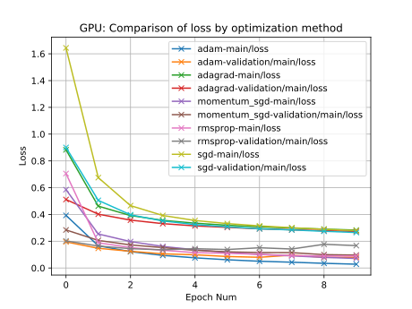

|| 1 | 2 | 3 | 4 | 5 | 6 | 7 | 8 | 9 | 10|
|--------------|:-:|:-:|:-:|:-:|:-:|:-:|:-:|:-:|:-:|:-:|
|SGD|1.644|0.675|0.466|0.392|0.355|0.332|0.315|0.301|0.289|0.279|0.9|0.505|0.397|0.351|0.324|0.308|0.293|0.284|0.274|0.265|
|Momentum SGD|0.585|0.254|0.197|0.161|0.136|0.116|0.102|0.09|0.08|0.071|0.284|0.206|0.172|0.152|0.132|0.121|0.116|0.115|0.1|0.096|
|AdaGrad|0.883|0.462|0.392|0.356|0.335|0.319|0.307|0.298|0.29|0.283|0.512|0.402|0.358|0.331|0.314|0.304|0.293|0.285|0.279|0.273|
|RMSprop|0.706|0.188|0.153|0.133|0.115|0.11|0.102|0.093|0.089|0.09|0.202|0.164|0.144|0.136|0.144|0.138|0.151|0.142|0.177|0.167|
|Adam|0.393|0.166|0.122|0.094|0.076|0.062|0.05|0.043|0.035|0.028|0.195|0.147|0.125|0.106|0.099|0.086|0.08|0.096|0.08|0.08|

  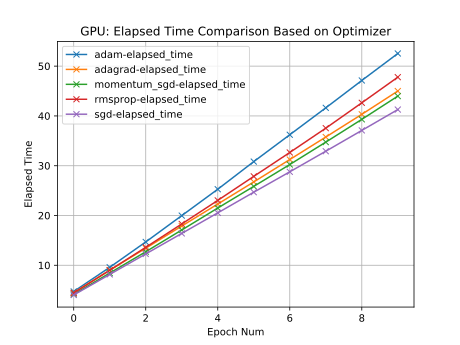

また，実行時間の詳細を下記に記す．

|| 1 | 2 | 3 | 4 | 5 | 6 | 7 | 8 | 9 | 10|
|--------------|:-:|:-:|:-:|:-:|:-:|:-:|:-:|:-:|:-:|:-:|
|SGD|4.037|8.166|12.282|16.403|20.53|24.679|28.776|32.909|37.088|41.276|
|Momentum SGD|4.174|8.442|12.723|17.088|21.5|25.849|30.236|34.738|39.309|43.977|
|AdaGrad|4.47|9.036|13.427|17.889|22.305|26.746|31.24|35.759|40.321|44.996|
|RMSprop|4.452|9.003|13.606|18.302|23.031|27.858|32.655|37.54|42.632|47.782|
|Adam|4.737|9.594|14.689|19.977|25.273|30.825|36.218|41.623|47.117|52.539|

---

## CNNを用いた実装

  

入力層: 100ノード  
中間層: 100ノード  
出力層: 10ノード

### CNNの考察

#### CPUにおける実行

MLPと同様の最適化手法で実行した．  

  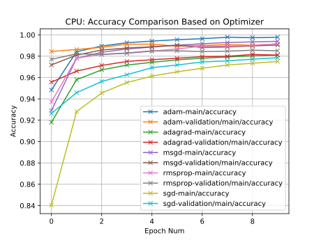

|| 1 | 2 | 3 | 4 | 5 | 6 | 7 | 8 | 9 | 10|
|--------------|:-:|:-:|:-:|:-:|:-:|:-:|:-:|:-:|:-:|:-:|
|SGD|0.84|0.928|0.945|0.955|0.961|0.965|0.969|0.972|0.973|0.975|0.926|0.946|0.956|0.963|0.969|0.972|0.975|0.976|0.977|0.979|
|Momentum SGD|0.929|0.978|0.984|0.987|0.989|0.99|0.992|0.993|0.993|0.994|0.972|0.981|0.986|0.988|0.989|0.99|0.988|0.989|0.99|0.99|
|AdaGrad|0.918|0.958|0.967|0.972|0.974|0.977|0.978|0.979|0.98|0.981|0.956|0.966|0.971|0.975|0.977|0.978|0.98|0.98|0.982|0.981|
|RMSprop|0.937|0.978|0.982|0.983|0.985|0.987|0.989|0.989|0.99|0.992|0.977|0.982|0.982|0.983|0.985|0.985|0.984|0.985|0.986|0.985|
|Adam|0.948|0.984|0.99|0.993|0.994|0.995|0.996|0.998|0.997|0.998|0.984|0.986|0.988|0.991|0.991|0.989|0.99|0.991|0.99|0.991|

精度に関して，MLPと同様にAdamが最も精度が高く，SGDが低いことがわかる．しかし，MLPとの大きな違いは同じエポック数ではあるが，最終精度はCNNの方が高いことがわかる．  
CNNは層が深くなるにつれて，高度な情報が抽出できるという特徴がある．実際に，精度が向上したことからも，画像の特徴を学習できていることがわかる．

  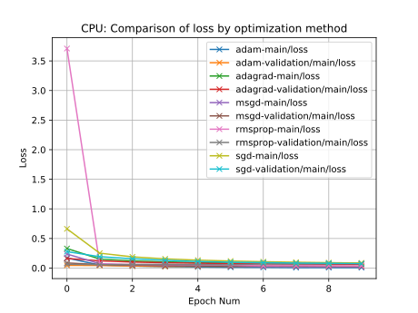

精度と同様で，推移の仕方はMLPと同様で，エポックが進むにつれ減少するが，減少の仕方，そして最終値はCNNの方が早く，小さいことがわかる．

  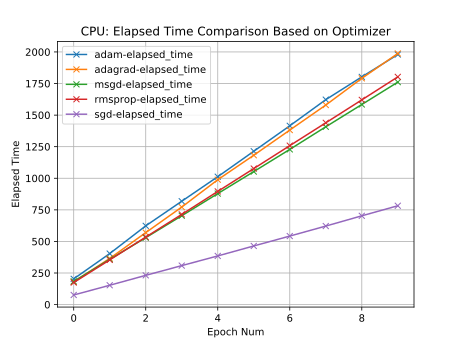

|| 1 | 2 | 3 | 4 | 5 | 6 | 7 | 8 | 9 | 10|
|--------------|:-:|:-:|:-:|:-:|:-:|:-:|:-:|:-:|:-:|:-:|
|SGD|75.933|152.981|231.385|308.516|385.121|464.174|542.356|621.559|702.755|782.435|
|Momentum SGD|183.302|358.159|529.788|703.318|878.563|1052.866|1228.512|1407.543|1584.041|1761.074|
|AdaGrad|180.316|365.234|569.659|771.951|988.549|1182.352|1381.614|1579.807|1790.997|1987.947|
|RMSprop|174.454|353.787|534.25|713.875|896.057|1076.677|1258.218|1439.177|1620.589|1802.72|
|Adam|203.57|403.729|623.307|818.173|1012.324|1213.937|1415.402|1622.417|1802.723|1979.814|

はじめに，RMSpropの方がAdaGradよりも実行時間が短い．  
精度と損失とは異なり，実行時間はCNNの方が100倍長いことがわかる．  

#### GPUにおける実行

ノード：turing  
ノード数：1  
CUDA：10.1

  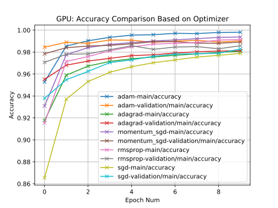

|| 1 | 2 | 3 | 4 | 5 | 6 | 7 | 8 | 9 | 10|
|--------------|:-:|:-:|:-:|:-:|:-:|:-:|:-:|:-:|:-:|:-:|
|SGD|0.865|0.937|0.953|0.962|0.967|0.97|0.973|0.975|0.977|0.979|0.938|0.955|0.962|0.97|0.973|0.976|0.978|0.979|0.979|0.983|
|Momentum SGD|0.931|0.978|0.984|0.987|0.989|0.99|0.991|0.992|0.993|0.994|0.978|0.984|0.985|0.986|0.987|0.99|0.99|0.988|0.988|0.989|
|AdaGrad|0.918|0.959|0.967|0.972|0.974|0.976|0.977|0.978|0.98|0.981|0.955|0.968|0.972|0.974|0.977|0.978|0.979|0.98|0.981|0.981|
|RMSprop|0.915|0.971|0.976|0.981|0.985|0.987|0.988|0.989|0.991|0.991|0.971|0.978|0.978|0.982|0.986|0.982|0.985|0.985|0.983|0.986|
|Adam|0.953|0.985|0.99|0.993|0.995|0.996|0.997|0.997|0.998|0.998|0.984|0.989|0.988|0.991|0.991|0.989|0.99|0.991|0.989|0.99|

上記の図や表からもGPUの方が精度が微小ではあるが良いことがわかる．

  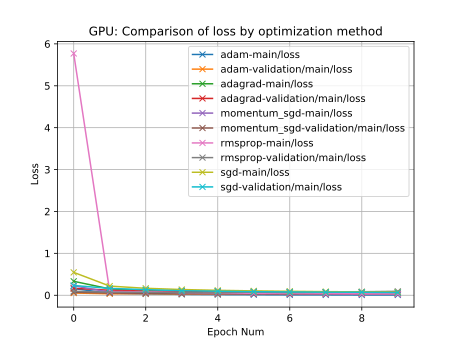

|| 1 | 2 | 3 | 4 | 5 | 6 | 7 | 8 | 9 | 10|
|--------------|:-:|:-:|:-:|:-:|:-:|:-:|:-:|:-:|:-:|:-:|
|SGD|0.545|0.218|0.166|0.136|0.117|0.104|0.094|0.086|0.08|0.075|0.233|0.163|0.133|0.107|0.096|0.085|0.078|0.073|0.071|0.064|
|Momentum SGD|0.224|0.074|0.053|0.043|0.038|0.033|0.029|0.025|0.023|0.021|0.07|0.053|0.048|0.04|0.039|0.033|0.031|0.036|0.034|0.035|
|AdaGrad|0.333|0.15|0.121|0.105|0.095|0.087|0.082|0.077|0.073|0.07|0.165|0.119|0.101|0.091|0.083|0.079|0.072|0.069|0.066|0.064|
|RMSprop|5.771|0.09|0.083|0.062|0.055|0.046|0.043|0.04|0.034|0.034|0.095|0.072|0.07|0.061|0.057|0.074|0.063|0.069|0.083|0.094|
|Adam|0.158|0.047|0.031|0.021|0.015|0.013|0.009|0.009|0.006|0.006|0.053|0.035|0.038|0.03|0.028|0.035|0.037|0.031|0.037|0.033|

損失は初期のパラメタに依存する場合もあるが，全体的に小さく抑えられていることから，学習がうまく進んでいることがわかる（もちろん，確実にうまく行われているのかは損失だけではわからないが）．  
また，精度と同様に，SGDの改良版Momentum SGD，AdaGradの改良版のRMSprop，そしてそれのさらに改良版Adamの方がそれぞれ損失が低いことから，改良されていることがわかる．  

  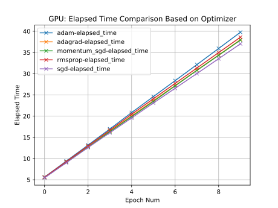

|| 1 | 2 | 3 | 4 | 5 | 6 | 7 | 8 | 9 | 10|
|--------------|:-:|:-:|:-:|:-:|:-:|:-:|:-:|:-:|:-:|:-:|
|SGD|5.457|9.014|12.608|16.092|19.569|23.087|26.552|30.028|33.527|37.031|
|Momentum SGD|5.529|9.107|12.684|16.329|19.885|23.453|27.131|30.77|34.332|37.91|
|AdaGrad|5.568|9.203|12.79|16.474|20.036|23.627|27.195|30.826|34.39|38.011|
|RMSprop|5.589|9.291|12.993|16.681|20.438|24.078|27.703|31.336|34.965|38.591|
|Adam|5.639|9.404|13.175|16.966|20.826|24.597|28.355|32.132|35.936|39.761|

CPUとの最も大きな違いが出たのは実行時間であった．  
CPUでは多くが30分程時間がかかっていたのに比べ，GPUでは10分の1程度で実行が終わる．  
また，最適化手法ごとの時間の差はあまり大きくない．しかし，1エポック目のみ他のエポックとは異なり時間がかかっている点がCPUとは異なる．これはパラメタの初期化と，メモリへのアクセスが遅延の理由であると考えている．GPUはメモリへのアクセスがCPUに比べ遅く，したがってキャッシュにデータがない初期は時間がかかると予想できる．  
しかし，同時にGPUはALU（Arithmetic Logic Units）がCPU以上に搭載されているため，計算が早く，2回目以降はキャッシュへのアクセスが可能になるため，計算能力に長けたGPUの方が早く実行が終わる．

---

